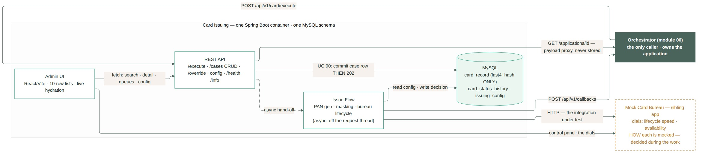

# Module 8 · Card Issuing — AI implementation briefs

One self-contained brief per use case: context, contract, acceptance criteria, data changes and the mermaid source for sequence / entity / state diagrams. Generated from the spec — regenerate, don't hand-edit.

| UC | file | track · prerequisite |
|---|---|---|
| 00 | [uc-00-process-application.md](uc-00-process-application.md) | B · none (foundation) |
| 01 | [uc-01-search-cards.md](uc-01-search-cards.md) | A · after 00 — the rows it lists come from intake |
| 02 | [uc-02-review-card-record.md](uc-02-review-card-record.md) | B · after 00 + 08 — the PAN test range comes from IssuingConfig |
| 03 | [uc-03-view-applicant.md](uc-03-view-applicant.md) | D · screen shell from 02 |
| 04 | [uc-04-failed-issues-queue.md](uc-04-failed-issues-queue.md) | A · after 01 |
| 05 | [uc-05-operate-mock-bureau-control-panel.md](uc-05-operate-mock-bureau-control-panel.md) | C · mock bureau exists (same track) |
| 06 | [uc-06-card-status-timeline.md](uc-06-card-status-timeline.md) | D · after 05 (bureau moving) + a card from 02 |
| 07 | [uc-07-override-case.md](uc-07-override-case.md) | B · after 02 is wired |
| 08 | [uc-08-edit-issuing-config.md](uc-08-edit-issuing-config.md) | C · none (foundation) |
| 09 (candidate) | [uc-09-card-design-tier-per-product.md](uc-09-card-design-tier-per-product.md) | C · after 01–08 |
| 10 (candidate) | [uc-10-pin-generation-separate-channel-dispatch.md](uc-10-pin-generation-separate-channel-dispatch.md) | B · after 01–08 (ambitious) |

Component/system diagram: 
