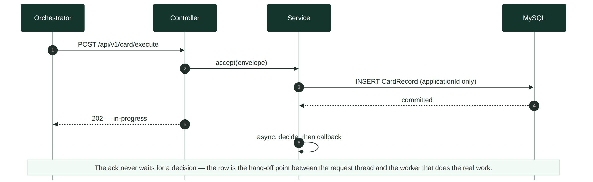
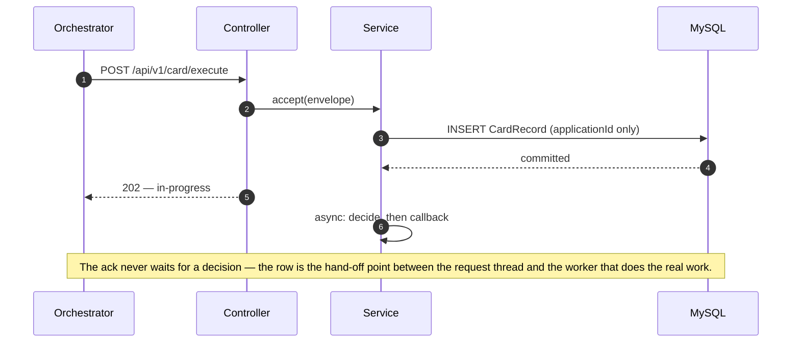
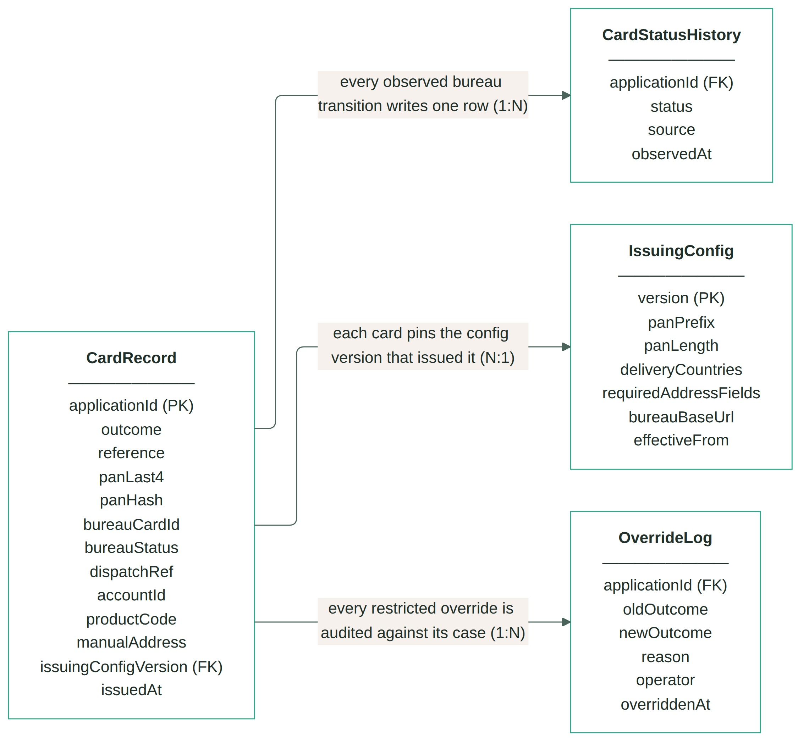
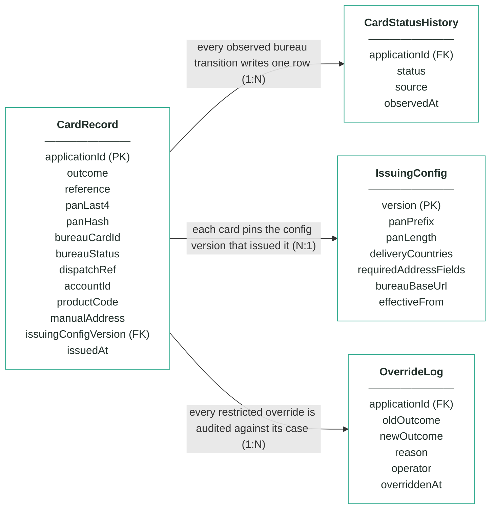
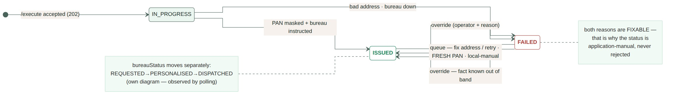
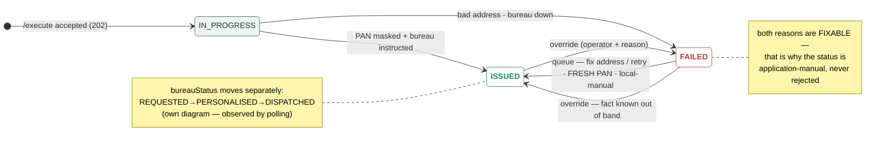

# Module 8 · Card Issuing — UC 00 · Process Application

> AI implementation brief, generated from the v5 spec (`spec/.../use-cases/`). Source of truth is the spec; regenerate, don't hand-edit.

## Context

- Module: 8 · Card Issuing · category Integration · domain `card` · command `issue-card` · outcomes: ISSUED, FAILED
- Use case: 00 · Process Application · track B · prerequisite: none (foundation) · build shape: API→DB · primary screen: — feeds every screen (row visible on the board)
- Data effect: one INSERT + 202 ack
- Platform rules (non-negotiable): the orchestrator is the only caller; the whole application arrives in the envelope (plus the v5 `outputs` block, Option A); steps are independent and re-orderable; the payload is NEVER stored — only `applicationId`; every module ships `GET /cases/{id}/applicant` proxying the orchestrator; big lists are empty by default and capped at 10 rows (≤10 hydration calls); ALL APIs are idempotent — same request twice, same result once; every endpoint appears in the service's OpenAPI 3.0 (Swagger) spec.

## Story

As the orchestrator I need every execute request acknowledged immediately and recorded durably, so the journey can advance and every other use case has a row to work on.

## Contract

```
POST /api/v1/card/execute
{ applicationId, correlationId,
  command: "issue-card",
  application: { … }, outputs: { … } }
→ 202 Accepted
{ "status": "in-progress",
  "applicationId": "app-1234",
  "command": "issue-card" }
```

## Acceptance criteria

1. POST /api/v1/card/execute with a valid envelope → 202 Accepted immediately — no rule or provider work happens on the request thread; body carries status "in-progress", the applicationId and the command.
2. Before the 202 is sent, exactly ONE CardRecord row exists, keyed by applicationId, in an in-progress state — a crash right after the ack loses nothing.  ⟵ **checkpoint — exact value**
3. Only the applicationId is persisted from the envelope — zero payload columns; the application object is handed to the off-thread worker, never stored.
4. Repeated /execute for the same applicationId → 202 again, still one row, no re-processing; once decided, the callback replays the stored outcome.
5. A malformed envelope (missing applicationId or command) → 400 with a JSON error body, and nothing is stored.
6. The off-thread decision starts only after the row is committed — everything in this module triggers from this row.
7. The new row is immediately visible to the search and case endpoints as an in-progress case.

## Expected data changes

- **INSERT one CardRecord row** keyed by applicationId — the ONLY applicant data ever stored.
- The row starts in-progress; every later use case UPDATEs or reads this same row.
- Idempotency = the unique key on applicationId; the trigger point = the commit.

## The Application entity — every field that arrives in the API

> The whole Application object is delivered in the envelope on every call. Fields this module reads are marked ●. The payload is NEVER stored — only `applicationId`.

| field | example | meaning |
|---|---|---|
| ● applicationId | app-1234 | journey key — every record this module stores is keyed by it; also the bureau instruction's reference |
| channel / submittedAt | MOBILE_APP · 2026-07-21… | ignored here — display only |
| ● applicant.fullName | Maria Nowak | EMBOSSED ON THE CARD — passed to the bureau in the issue instruction; UI shows it via live hydration only |
| applicant.dateOfBirth / nationality | 1996-04-11 · PL | ignored here — modules 1–4 consumed them |
| applicant.email / mobile | maria@…  +4477… | ignored here — module 6 used them |
| ● applicant.currentAddress | 42 Hanbury St, E1 5JP | where the card is POSTED when delivery.useCurrentAddress=true — read, sent to the bureau, never persisted |
| identityDocument.* / employment.* / finances.* | … | ignored here — modules 3 and 5 |
| ● product.productCode | CREDIT_CARD_REWARDS | card artwork/scheme per product; the candidate design/tier rule keys off it |
| product.requestedCreditLimit | 3000 | ignored here — module 5 decided; outputs carries the truth |
| ● delivery.useCurrentAddress | true | rule 2's input: true → post to currentAddress; false → delivery.address must be complete |
| ● delivery.address | null | the alternative delivery address — false + null → FAILED (CRD_DELIVERY_ADDRESS_INVALID) |
| consents.* | true · false | ignored here — module 6's concern |
| ● outputs.accountId | acc-000123 | module 7's account — anchored on CardRecord: the account this card spends against (v5 Option A) |
| outputs.approvedLimit / apr / agreementId | 2800 · 24.9 · agr-000077 | present, unused — carried for completeness; the card does not need them |
| outputs.cardId | (absent) | written by the orchestrator AFTER this step, from this module's own callback reference |

_Ground rules: unknown fields are ignored on the way in and never emitted on the way out · countries ISO alpha-2 uppercase · dates YYYY-MM-DD · money = integer GBP · optional = null, never "" or 0. This module reads FOUR things: the name, the delivery block, the product code and outputs.accountId — and one thing it makes itself: the PAN, which no payload ever carries._

## Diagrams

> Rendered images first (for PDF/preview); the mermaid source is collapsed underneath for machine consumption.

### Sequence — this use case



<details><summary>mermaid source</summary>



</details>

### Entity model (suggested — the shape to beat)



**CardRecord — one card per applicationId (unique), masked from birth; no column can hold a full PAN**

| field | type | key | meaning |
|---|---|---|---|
| applicationId | string | PK | the journey key from the envelope — unique, the ONLY applicant-related column, AND the bureau instruction's reference |
| outcome | enum |  | ISSUED or FAILED — both FAILED reasons (bad address, bureau down) are fixable by a person, never a refusal |
| reference | string |  | human-facing case reference shown on screens and in the callback, e.g. crd-000064 — becomes outputs.cardId |
| panLast4 | char(4) |  | the last four digits, e.g. 4242 — the human-readable half of the masked pair; the column physically cannot hold more |
| panHash | char(64) |  | salted SHA-256 of the full PAN — answers "is this the same card?" for machines; NEVER the PAN itself |
| bureauCardId | string, nullable |  | the bureau's own id for the card, e.g. bur-77103; null on FAILED |
| bureauStatus | enum |  | the factory's lifecycle as last observed by polling: REQUESTED, PERSONALISED or DISPATCHED — moved by the bureau, never by command |
| dispatchRef | string, nullable |  | the postal tracking reference, e.g. RM-2214-9915 — null until the bureau reports DISPATCHED |
| accountId | string, nullable |  | module 7's account from outputs, e.g. acc-000123 — the account this card spends against; anchored-and-flagged if absent (re-ordered saga) |
| productCode | string |  | the product issued, e.g. CREDIT_CARD_REWARDS — drives card artwork/tier in the candidate design rule |
| manualAddress | boolean |  | true when an operator typed a corrected delivery address in the queue — the address itself is never persisted, only this trace |
| issuingConfigVersion | int | FK | the IssuingConfig version whose PAN range and delivery rules issued this card — pinned forever |
| issuedAt | timestamp, nullable |  | when the card was issued (PAN generated, bureau instructed); null on FAILED |

**IssuingConfig — insert-only, versioned PAN range and delivery rules; current = MAX(version)**

| field | type | key | meaning |
|---|---|---|---|
| version | int | PK | one new row per change — rows are inserted, never updated; current = MAX(version) |
| panPrefix | string |  | the reserved TEST range every PAN starts with (seeded 999900) — no real network owns it, so no generated number can collide with a live card |
| panLength | int |  | total PAN length including the Luhn check digit (seeded 16) |
| deliveryCountries | JSON |  | countries the bureau will post to (seeded [GB, IE]) — rule 2 rejects addresses outside them |
| requiredAddressFields | JSON |  | the fields an alternative delivery address must have (seeded [line1, city, postcode, country]) |
| bureauBaseUrl | string |  | where the mock bureau lives — the base URL for instructions and status polls |
| effectiveFrom | timestamp |  | when this version became the current one |

**CardStatusHistory — the observed bureau lifecycle; one append-only row per transition, written by the poller**

| field | type | key | meaning |
|---|---|---|---|
| applicationId | string | FK | the card whose observed transition this row records |
| status | enum |  | the bureau status observed: REQUESTED, PERSONALISED or DISPATCHED — the timeline screen reads straight off this |
| source | enum |  | how the observation happened: ISSUE (the initial instruction) or POLL (the scheduled status check) |
| observedAt | timestamp |  | when THIS module saw the transition — the bureau moves on its own clock; we find out by asking |

**OverrideLog — audit trail; one row per manual override, none ever deleted**

| field | type | key | meaning |
|---|---|---|---|
| applicationId | string | FK | the card case that was overridden |
| oldOutcome | enum |  | the outcome before the override |
| newOutcome | enum |  | the outcome after — a human-known fact asserted without touching the bureau |
| reason | string |  | the mandatory justification typed by the operator |
| operator | string |  | who performed the override |
| overriddenAt | timestamp |  | when it happened |

Relationships: CardRecord 1:N CardStatusHistory — every observed bureau transition writes one row · CardRecord N:1 IssuingConfig — each card pins the config version that issued it · CardRecord 1:N OverrideLog — every restricted override is audited against its case

<details><summary>mermaid source (generated from the spec tables)</summary>



</details>

### State transitions — the case record



<details><summary>mermaid source</summary>



</details>

## Out of scope

Deciding anything (that is the engine use case, which runs off-thread AFTER this row exists); the callback content.

## Build notes

Partially implemented by the template — the 202-then-callback controller is given. Your work: the durable CardRecord row, idempotency by applicationId, and the async hand-off. EVERY other use case depends on this one: no row, no review, no queue, no override, no report.

## Tests

Slice test: 202 shape + row inserted before the ack returns; repeated /execute → one row; malformed envelope → 400 and nothing stored.

## Sequence caption

The ack never waits for a decision — the row is the hand-off point between the request thread and the worker that does the real work.

## Definition of done

All acceptance criteria verified against the running app · `./mvnw test` green · teammate-reviewed PR merged to main · fresh clone builds green · endpoint idempotent + present in the OpenAPI 3.0 (Swagger) spec · demoable from the UI.
