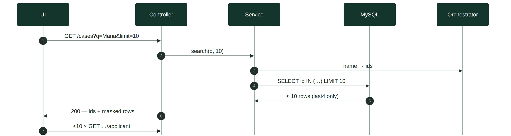
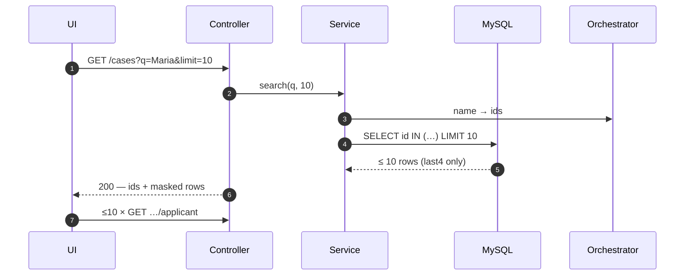
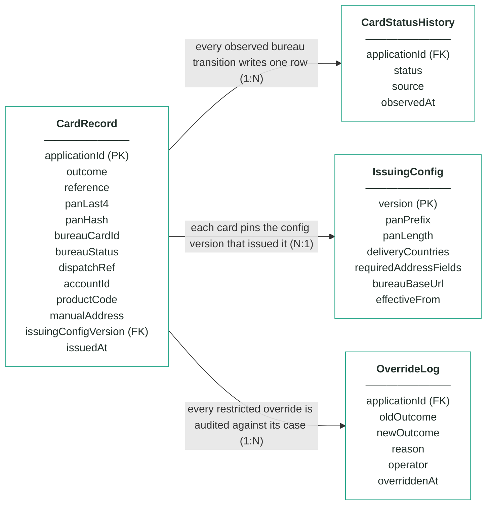
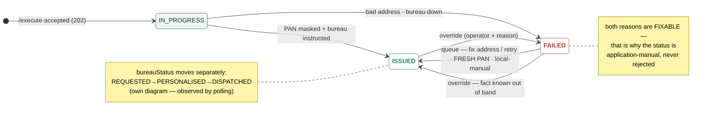

# Module 8 · Card Issuing — UC 01 · Search Cards

> AI implementation brief, generated from the v5 spec (`spec/.../use-cases/`). Source of truth is the spec; regenerate, don't hand-edit.

## Context

- Module: 8 · Card Issuing · category Integration · domain `card` · command `issue-card` · outcomes: ISSUED, FAILED
- Use case: 01 · Search Cards · track A · prerequisite: after 00 — the rows it lists come from intake · build shape: DB→API→FE · primary screen: Card Board
- Data effect: read-only · zero payload stored
- Platform rules (non-negotiable): the orchestrator is the only caller; the whole application arrives in the envelope (plus the v5 `outputs` block, Option A); steps are independent and re-orderable; the payload is NEVER stored — only `applicationId`; every module ships `GET /cases/{id}/applicant` proxying the orchestrator; big lists are empty by default and capped at 10 rows (≤10 hydration calls); ALL APIs are idempotent — same request twice, same result once; every endpoint appears in the service's OpenAPI 3.0 (Swagger) spec.

## Story

As a bank employee I want to find a card case by application id or applicant name — without this module ever storing applicant data, and without ever seeing more than four digits of a card number.

## Contract

```
GET /cases?q={id-or-name}&limit=10 →
[{"applicationId":"app-1234",
  "outcome":"ISSUED","panLast4":"4242",
  "bureauStatus":"DISPATCHED",
  "issuedAt":"2026-07-22T09:21:00Z"}, …]
// applicantName is NOT in the row —
// the UI hydrates ≤10 rows live
```

## Acceptance criteria

1. The Card Board is EMPTY by default — no query, no rows fetched, a hint invites a search.
2. GET /cases?q=… → 200 + at most 10 matches, newest first; an 11th match means the response flags "more — refine your search".
3. Search by applicationId works entirely from the local table; search by name resolves ids through the orchestrator first — nothing about the applicant is ever persisted.
4. The applicant-name column hydrates live via the module's application-fetch GET — at most 10 calls per render, cached per page view.
5. Searching "Maria" shows her card with outcome = "ISSUED" and the number rendered as **** **** **** 4242.  ⟵ **checkpoint — exact value**
6. No response from this endpoint ever contains more than 4 consecutive PAN digits — asserted by a slice test with a regex over the raw JSON.
7. No matches → [] and HTTP 200 (never a 500); orchestrator down → rows render with ids, names show a retryable "—".

## Expected data changes

- **No rows change, and no applicant data ever lands in MySQL.** The schema has no name column to search.
- Name → ids via the orchestrator; ids → local records; names on screen via ≤10 live hydration calls.
- The masking is not a UI favour — the API physically cannot return more than last-4, because more was never stored.

## Diagrams

> Rendered images first (for PDF/preview); the mermaid source is collapsed underneath for machine consumption.

### Sequence — this use case



<details><summary>mermaid source</summary>



</details>

### Entity model (suggested — the shape to beat)


**CardRecord — one card per applicationId (unique), masked from birth; no column can hold a full PAN**

| field | type | key | meaning |
|---|---|---|---|
| applicationId | string | PK | the journey key from the envelope — unique, the ONLY applicant-related column, AND the bureau instruction's reference |
| outcome | enum |  | ISSUED or FAILED — both FAILED reasons (bad address, bureau down) are fixable by a person, never a refusal |
| reference | string |  | human-facing case reference shown on screens and in the callback, e.g. crd-000064 — becomes outputs.cardId |
| panLast4 | char(4) |  | the last four digits, e.g. 4242 — the human-readable half of the masked pair; the column physically cannot hold more |
| panHash | char(64) |  | salted SHA-256 of the full PAN — answers "is this the same card?" for machines; NEVER the PAN itself |
| bureauCardId | string, nullable |  | the bureau's own id for the card, e.g. bur-77103; null on FAILED |
| bureauStatus | enum |  | the factory's lifecycle as last observed by polling: REQUESTED, PERSONALISED or DISPATCHED — moved by the bureau, never by command |
| dispatchRef | string, nullable |  | the postal tracking reference, e.g. RM-2214-9915 — null until the bureau reports DISPATCHED |
| accountId | string, nullable |  | module 7's account from outputs, e.g. acc-000123 — the account this card spends against; anchored-and-flagged if absent (re-ordered saga) |
| productCode | string |  | the product issued, e.g. CREDIT_CARD_REWARDS — drives card artwork/tier in the candidate design rule |
| manualAddress | boolean |  | true when an operator typed a corrected delivery address in the queue — the address itself is never persisted, only this trace |
| issuingConfigVersion | int | FK | the IssuingConfig version whose PAN range and delivery rules issued this card — pinned forever |
| issuedAt | timestamp, nullable |  | when the card was issued (PAN generated, bureau instructed); null on FAILED |

**IssuingConfig — insert-only, versioned PAN range and delivery rules; current = MAX(version)**

| field | type | key | meaning |
|---|---|---|---|
| version | int | PK | one new row per change — rows are inserted, never updated; current = MAX(version) |
| panPrefix | string |  | the reserved TEST range every PAN starts with (seeded 999900) — no real network owns it, so no generated number can collide with a live card |
| panLength | int |  | total PAN length including the Luhn check digit (seeded 16) |
| deliveryCountries | JSON |  | countries the bureau will post to (seeded [GB, IE]) — rule 2 rejects addresses outside them |
| requiredAddressFields | JSON |  | the fields an alternative delivery address must have (seeded [line1, city, postcode, country]) |
| bureauBaseUrl | string |  | where the mock bureau lives — the base URL for instructions and status polls |
| effectiveFrom | timestamp |  | when this version became the current one |

**CardStatusHistory — the observed bureau lifecycle; one append-only row per transition, written by the poller**

| field | type | key | meaning |
|---|---|---|---|
| applicationId | string | FK | the card whose observed transition this row records |
| status | enum |  | the bureau status observed: REQUESTED, PERSONALISED or DISPATCHED — the timeline screen reads straight off this |
| source | enum |  | how the observation happened: ISSUE (the initial instruction) or POLL (the scheduled status check) |
| observedAt | timestamp |  | when THIS module saw the transition — the bureau moves on its own clock; we find out by asking |

**OverrideLog — audit trail; one row per manual override, none ever deleted**

| field | type | key | meaning |
|---|---|---|---|
| applicationId | string | FK | the card case that was overridden |
| oldOutcome | enum |  | the outcome before the override |
| newOutcome | enum |  | the outcome after — a human-known fact asserted without touching the bureau |
| reason | string |  | the mandatory justification typed by the operator |
| operator | string |  | who performed the override |
| overriddenAt | timestamp |  | when it happened |

Relationships: CardRecord 1:N CardStatusHistory — every observed bureau transition writes one row · CardRecord N:1 IssuingConfig — each card pins the config version that issued it · CardRecord 1:N OverrideLog — every restricted override is audited against its case

<details><summary>mermaid source (generated from the spec tables)</summary>



</details>

### State transitions — the case record


<details><summary>mermaid source</summary>



</details>

## Out of scope

Pagination beyond the 10-row cap (refine the search instead); searching by card number (only last-4 exists to search by — and that is a UC 02 exact-match concern, not free text).

## Build notes

v5 payload rule: no applicant columns exist, so name search resolves ids via the orchestrator (GET /applications?name= — a v5 contract addition) and id search hits the local table. The board hydrates the applicant-name column live, one GET per visible row, 10 max. The row DTO carries panLast4 pre-masked — the raw hash never leaves the API.

## Tests

Web-slice test: empty default, 10-row cap, id search local, name search via mocked orchestrator client, empty [] case, response contains no 16-digit sequences (regex assert).

## Definition of done

All acceptance criteria verified against the running app · `./mvnw test` green · teammate-reviewed PR merged to main · fresh clone builds green · endpoint idempotent + present in the OpenAPI 3.0 (Swagger) spec · demoable from the UI.
