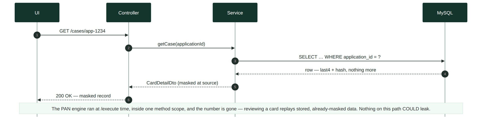
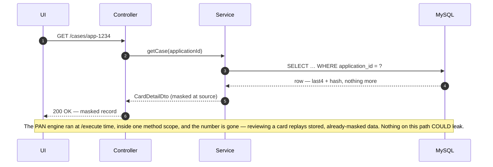
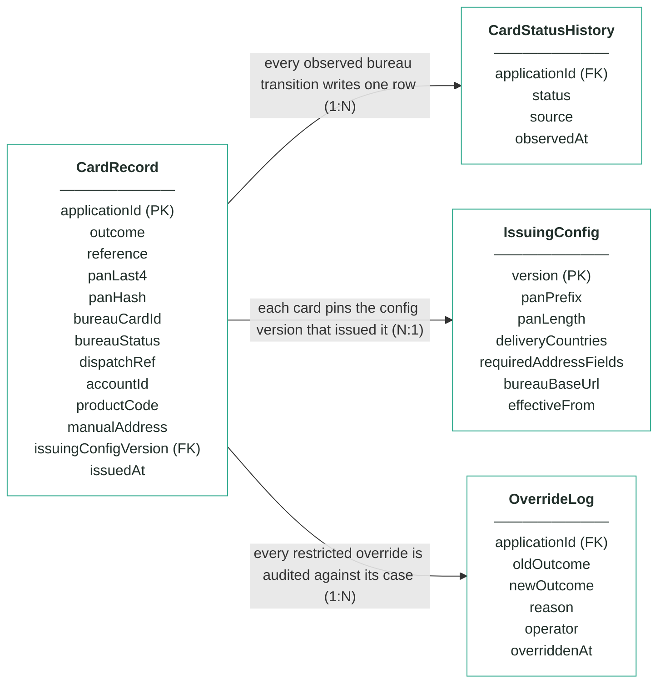
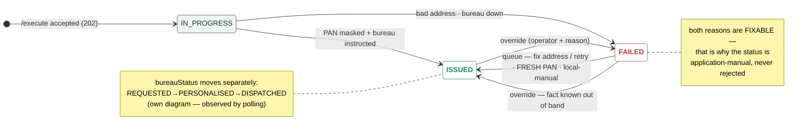

# Module 8 · Card Issuing — UC 02 · Review Card Record

> AI implementation brief, generated from the v5 spec (`spec/.../use-cases/`). Source of truth is the spec; regenerate, don't hand-edit.

## Context

- Module: 8 · Card Issuing · category Integration · domain `card` · command `issue-card` · outcomes: ISSUED, FAILED
- Use case: 02 · Review Card Record · track B · prerequisite: after 00 + 08 — the PAN test range comes from IssuingConfig · build shape: API+FE (engine: DB) · primary screen: Card Detail
- Data effect: read-only (row written earlier)
- Platform rules (non-negotiable): the orchestrator is the only caller; the whole application arrives in the envelope (plus the v5 `outputs` block, Option A); steps are independent and re-orderable; the payload is NEVER stored — only `applicationId`; every module ships `GET /cases/{id}/applicant` proxying the orchestrator; big lists are empty by default and capped at 10 rows (≤10 hydration calls); ALL APIs are idempotent — same request twice, same result once; every endpoint appears in the service's OpenAPI 3.0 (Swagger) spec.

## Story

As a bank employee I want to open a card record and see everything it holds — masked number, bureau status, dispatch details, the account it belongs to — and be certain the full number is not in it, because it is not anywhere.

## Contract

```
GET /cases/{applicationId} →
{"outcome":"ISSUED","reference":"crd-000064",
 "panMasked":"**** **** **** 4242",
 "panHash":"a91c…e4 (sha-256, salted)",
 "bureauCardId":"bur-77103",
 "bureauStatus":"DISPATCHED",
 "dispatchRef":"RM-2214-9915",
 "accountId":"acc-000123",
 "productCode":"CREDIT_CARD_REWARDS",
 "issuingConfigVersion":1,
 "reasons":[{"code":"CRD_ISSUED"}]}
```

## Acceptance criteria

1. GET /cases/{applicationId} → 200 + outcome, reference, panMasked, panHash, bureauCardId, bureauStatus, dispatchRef, accountId, productCode, issuingConfigVersion, reasons[].
2. Maria Nowak (app-1234) → ISSUED, panMasked **** **** **** 4242, bureauCardId bur-77103, accountId acc-000123 (from outputs).  ⟵ **checkpoint — exact value**
3. Every generated PAN is Luhn-valid, 16 digits, prefix 999900 — asserted by a property test over 1,000 generations.  ⟵ **checkpoint — exact value**
4. The card table stores panLast4 CHAR(4) + panHash only — a DB dump contains no 16-digit sequence; the schema has no column that could hold one.
5. No log line from a full issue run — happy path AND forced error paths — contains a full PAN: proven by the repo's grep script over captured logs.
6. Address validation precedes PAN generation: Sofia's FAILED case (CRD_DELIVERY_ADDRESS_INVALID) has NO panLast4, NO panHash — no card data was ever created for it.  ⟵ **checkpoint — exact value**
7. Repeated /execute for the same applicationId → still one row, no new PAN generated, no new bureau instruction, callback replays the stored outcome.
8. Unknown applicationId → 404 with a JSON error body (never a 500) — and even the error body is checked by the no-PAN slice assert.

## Expected data changes

- **This GET changes nothing.** The row it reads was written once, off-thread, by /execute.
- On /execute: validate address → generate PAN → instruct bureau → INSERT card_record (last4 + hash + REQUESTED) + first card_status_history row — the full number is discarded before the transaction commits.
- Unique key on application_id is what makes the idempotency AC provable.

## Diagrams

> Rendered images first (for PDF/preview); the mermaid source is collapsed underneath for machine consumption.

### Sequence — this use case



<details><summary>mermaid source</summary>



</details>

### Entity model (suggested — the shape to beat)


**CardRecord — one card per applicationId (unique), masked from birth; no column can hold a full PAN**

| field | type | key | meaning |
|---|---|---|---|
| applicationId | string | PK | the journey key from the envelope — unique, the ONLY applicant-related column, AND the bureau instruction's reference |
| outcome | enum |  | ISSUED or FAILED — both FAILED reasons (bad address, bureau down) are fixable by a person, never a refusal |
| reference | string |  | human-facing case reference shown on screens and in the callback, e.g. crd-000064 — becomes outputs.cardId |
| panLast4 | char(4) |  | the last four digits, e.g. 4242 — the human-readable half of the masked pair; the column physically cannot hold more |
| panHash | char(64) |  | salted SHA-256 of the full PAN — answers "is this the same card?" for machines; NEVER the PAN itself |
| bureauCardId | string, nullable |  | the bureau's own id for the card, e.g. bur-77103; null on FAILED |
| bureauStatus | enum |  | the factory's lifecycle as last observed by polling: REQUESTED, PERSONALISED or DISPATCHED — moved by the bureau, never by command |
| dispatchRef | string, nullable |  | the postal tracking reference, e.g. RM-2214-9915 — null until the bureau reports DISPATCHED |
| accountId | string, nullable |  | module 7's account from outputs, e.g. acc-000123 — the account this card spends against; anchored-and-flagged if absent (re-ordered saga) |
| productCode | string |  | the product issued, e.g. CREDIT_CARD_REWARDS — drives card artwork/tier in the candidate design rule |
| manualAddress | boolean |  | true when an operator typed a corrected delivery address in the queue — the address itself is never persisted, only this trace |
| issuingConfigVersion | int | FK | the IssuingConfig version whose PAN range and delivery rules issued this card — pinned forever |
| issuedAt | timestamp, nullable |  | when the card was issued (PAN generated, bureau instructed); null on FAILED |

**IssuingConfig — insert-only, versioned PAN range and delivery rules; current = MAX(version)**

| field | type | key | meaning |
|---|---|---|---|
| version | int | PK | one new row per change — rows are inserted, never updated; current = MAX(version) |
| panPrefix | string |  | the reserved TEST range every PAN starts with (seeded 999900) — no real network owns it, so no generated number can collide with a live card |
| panLength | int |  | total PAN length including the Luhn check digit (seeded 16) |
| deliveryCountries | JSON |  | countries the bureau will post to (seeded [GB, IE]) — rule 2 rejects addresses outside them |
| requiredAddressFields | JSON |  | the fields an alternative delivery address must have (seeded [line1, city, postcode, country]) |
| bureauBaseUrl | string |  | where the mock bureau lives — the base URL for instructions and status polls |
| effectiveFrom | timestamp |  | when this version became the current one |

**CardStatusHistory — the observed bureau lifecycle; one append-only row per transition, written by the poller**

| field | type | key | meaning |
|---|---|---|---|
| applicationId | string | FK | the card whose observed transition this row records |
| status | enum |  | the bureau status observed: REQUESTED, PERSONALISED or DISPATCHED — the timeline screen reads straight off this |
| source | enum |  | how the observation happened: ISSUE (the initial instruction) or POLL (the scheduled status check) |
| observedAt | timestamp |  | when THIS module saw the transition — the bureau moves on its own clock; we find out by asking |

**OverrideLog — audit trail; one row per manual override, none ever deleted**

| field | type | key | meaning |
|---|---|---|---|
| applicationId | string | FK | the card case that was overridden |
| oldOutcome | enum |  | the outcome before the override |
| newOutcome | enum |  | the outcome after — a human-known fact asserted without touching the bureau |
| reason | string |  | the mandatory justification typed by the operator |
| operator | string |  | who performed the override |
| overriddenAt | timestamp |  | when it happened |

Relationships: CardRecord 1:N CardStatusHistory — every observed bureau transition writes one row · CardRecord N:1 IssuingConfig — each card pins the config version that issued it · CardRecord 1:N OverrideLog — every restricted override is audited against its case

<details><summary>mermaid source (generated from the spec tables)</summary>



</details>

### State transitions — the case record


<details><summary>mermaid source</summary>



</details>

## Out of scope

Editing a card (records are immutable — override is UC 07, retry is UC 04); the /execute wiring itself (template gives it); unmasking (there is nothing to unmask).

## Build notes

The PAN engine is plain functions, built and tested before any Spring wiring: generate(prefix, length, rng) → Luhn-valid number; mask(pan) → last4; hash(pan, salt) → digest. The issue flow composes them so the full PAN lives inside ONE method scope: generated, sent to the bureau, masked+hashed, discarded — in that order, no field, no logger in reach. Address validation runs BEFORE generation: no PAN for an undeliverable card.

## Tests

Engine: property test — 1,000 generated numbers all Luhn-valid, all prefix 999900, length 16, no duplicates; mask/hash unit tests. Flow: address-first ordering, idempotent replay. Slice: the GET's JSON contains no 16-digit sequence. Log test: run happy + error paths, grep captured logs for the test-range regex → zero.

## Sequence caption

The PAN engine ran at /execute time, inside one method scope, and the number is gone — reviewing a card replays stored, already-masked data. Nothing on this path COULD leak.

## Definition of done

All acceptance criteria verified against the running app · `./mvnw test` green · teammate-reviewed PR merged to main · fresh clone builds green · endpoint idempotent + present in the OpenAPI 3.0 (Swagger) spec · demoable from the UI.
