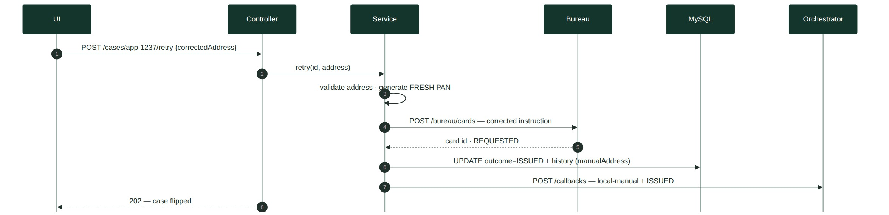
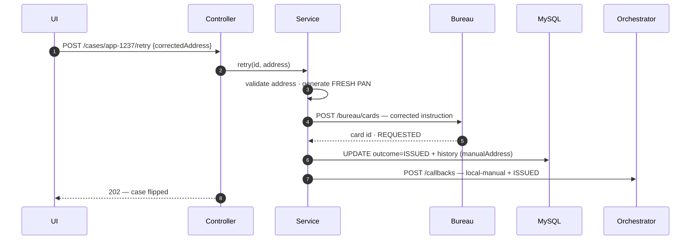
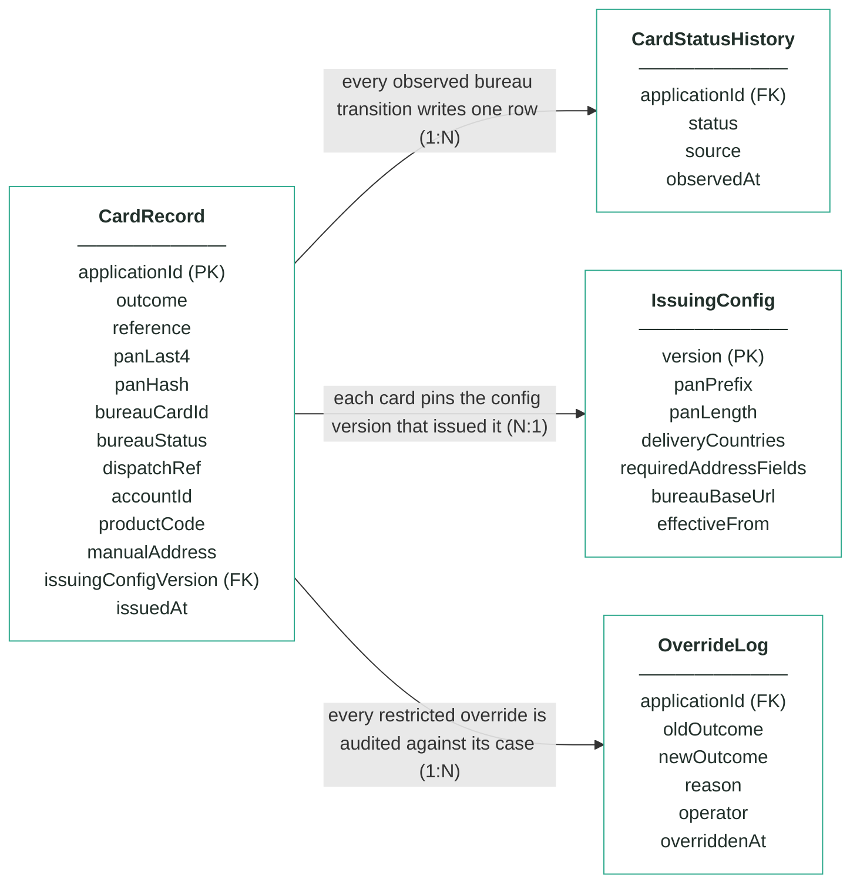
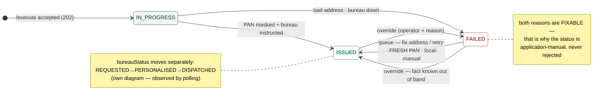

# Module 8 · Card Issuing — UC 04 · Failed-Issues Queue

> AI implementation brief, generated from the v5 spec (`spec/.../use-cases/`). Source of truth is the spec; regenerate, don't hand-edit.

## Context

- Module: 8 · Card Issuing · category Integration · domain `card` · command `issue-card` · outcomes: ISSUED, FAILED
- Use case: 04 · Failed-Issues Queue · track A · prerequisite: after 01 · build shape: API+FE (+ retry write) · primary screen: Failed-Issues Queue
- Data effect: one action → fresh PAN + callback
- Platform rules (non-negotiable): the orchestrator is the only caller; the whole application arrives in the envelope (plus the v5 `outputs` block, Option A); steps are independent and re-orderable; the payload is NEVER stored — only `applicationId`; every module ships `GET /cases/{id}/applicant` proxying the orchestrator; big lists are empty by default and capped at 10 rows (≤10 hydration calls); ALL APIs are idempotent — same request twice, same result once; every endpoint appears in the service's OpenAPI 3.0 (Swagger) spec.

## Story

As a bank employee I want a queue of failed issues with the right action per failure — enter a corrected address for CRD_DELIVERY_ADDRESS_INVALID, one-click retry for CRD_BUREAU_UNAVAILABLE — because both are fixable and the applicant has already been approved.

## Contract

```
GET /queue → oldest first, FAILED only,
  max 10, action per reason

POST /cases/{id}/retry
{"correctedAddress":{"line1":"1 Bank Sq",
  "city":"London","postcode":"EC2 4AA",
  "country":"GB"}}   // ONLY for address
→ 202 {"status":"retrying"}
```

## Acceptance criteria

1. GET /queue → 200 + only FAILED cases, oldest first, max 10 rows, names hydrated live; each row shows its reason and the matching action (Fix address & retry / Retry).
2. Sofia's case (app-1237) shows CRD_DELIVERY_ADDRESS_INVALID with the fix-address form; Tom's (app-1240) shows CRD_BUREAU_UNAVAILABLE with one-click retry.  ⟵ **checkpoint — exact value**
3. An address retry validates the corrected address against the current IssuingConfig delivery rules — an incomplete or non-deliverable address → 400 with field errors, no PAN generated, case unchanged.
4. A successful retry generates a FRESH PAN (new last4/hash — asserted), instructs the bureau, flips the case to ISSUED, and fires one callback with status local-manual + outcome ISSUED — the parked journey resumes.  ⟵ **checkpoint — exact value**
5. The corrected address is NOT persisted in this module — the history records manualAddress=true, the schema still has no address column, and the sidebar (UC 03) still shows the orchestrator's version.
6. A bureau-down retry while the bureau is still down → case stays FAILED, no callback fires (the journey is already parked), the queue row shows the last attempt time.
7. Retry on a non-FAILED case → 400; unknown id → 404.

## Expected data changes

- **UPDATE card_record** SET outcome=ISSUED, new panLast4/panHash, bureauCardId — the retry is a real re-issue.
- **INSERT card_status_history** (REQUESTED, source ISSUE, manualAddress=true when corrected).
- The corrected address itself is written NOWHERE in this module — it lives in the bureau instruction and the orchestrator's copy of the truth.
- Callback status local-manual: an operator acted, the journey resumes.

## Diagrams

> Rendered images first (for PDF/preview); the mermaid source is collapsed underneath for machine consumption.

### Sequence — this use case



<details><summary>mermaid source</summary>



</details>

### Entity model (suggested — the shape to beat)


**CardRecord — one card per applicationId (unique), masked from birth; no column can hold a full PAN**

| field | type | key | meaning |
|---|---|---|---|
| applicationId | string | PK | the journey key from the envelope — unique, the ONLY applicant-related column, AND the bureau instruction's reference |
| outcome | enum |  | ISSUED or FAILED — both FAILED reasons (bad address, bureau down) are fixable by a person, never a refusal |
| reference | string |  | human-facing case reference shown on screens and in the callback, e.g. crd-000064 — becomes outputs.cardId |
| panLast4 | char(4) |  | the last four digits, e.g. 4242 — the human-readable half of the masked pair; the column physically cannot hold more |
| panHash | char(64) |  | salted SHA-256 of the full PAN — answers "is this the same card?" for machines; NEVER the PAN itself |
| bureauCardId | string, nullable |  | the bureau's own id for the card, e.g. bur-77103; null on FAILED |
| bureauStatus | enum |  | the factory's lifecycle as last observed by polling: REQUESTED, PERSONALISED or DISPATCHED — moved by the bureau, never by command |
| dispatchRef | string, nullable |  | the postal tracking reference, e.g. RM-2214-9915 — null until the bureau reports DISPATCHED |
| accountId | string, nullable |  | module 7's account from outputs, e.g. acc-000123 — the account this card spends against; anchored-and-flagged if absent (re-ordered saga) |
| productCode | string |  | the product issued, e.g. CREDIT_CARD_REWARDS — drives card artwork/tier in the candidate design rule |
| manualAddress | boolean |  | true when an operator typed a corrected delivery address in the queue — the address itself is never persisted, only this trace |
| issuingConfigVersion | int | FK | the IssuingConfig version whose PAN range and delivery rules issued this card — pinned forever |
| issuedAt | timestamp, nullable |  | when the card was issued (PAN generated, bureau instructed); null on FAILED |

**IssuingConfig — insert-only, versioned PAN range and delivery rules; current = MAX(version)**

| field | type | key | meaning |
|---|---|---|---|
| version | int | PK | one new row per change — rows are inserted, never updated; current = MAX(version) |
| panPrefix | string |  | the reserved TEST range every PAN starts with (seeded 999900) — no real network owns it, so no generated number can collide with a live card |
| panLength | int |  | total PAN length including the Luhn check digit (seeded 16) |
| deliveryCountries | JSON |  | countries the bureau will post to (seeded [GB, IE]) — rule 2 rejects addresses outside them |
| requiredAddressFields | JSON |  | the fields an alternative delivery address must have (seeded [line1, city, postcode, country]) |
| bureauBaseUrl | string |  | where the mock bureau lives — the base URL for instructions and status polls |
| effectiveFrom | timestamp |  | when this version became the current one |

**CardStatusHistory — the observed bureau lifecycle; one append-only row per transition, written by the poller**

| field | type | key | meaning |
|---|---|---|---|
| applicationId | string | FK | the card whose observed transition this row records |
| status | enum |  | the bureau status observed: REQUESTED, PERSONALISED or DISPATCHED — the timeline screen reads straight off this |
| source | enum |  | how the observation happened: ISSUE (the initial instruction) or POLL (the scheduled status check) |
| observedAt | timestamp |  | when THIS module saw the transition — the bureau moves on its own clock; we find out by asking |

**OverrideLog — audit trail; one row per manual override, none ever deleted**

| field | type | key | meaning |
|---|---|---|---|
| applicationId | string | FK | the card case that was overridden |
| oldOutcome | enum |  | the outcome before the override |
| newOutcome | enum |  | the outcome after — a human-known fact asserted without touching the bureau |
| reason | string |  | the mandatory justification typed by the operator |
| operator | string |  | who performed the override |
| overriddenAt | timestamp |  | when it happened |

Relationships: CardRecord 1:N CardStatusHistory — every observed bureau transition writes one row · CardRecord N:1 IssuingConfig — each card pins the config version that issued it · CardRecord 1:N OverrideLog — every restricted override is audited against its case

<details><summary>mermaid source (generated from the spec tables)</summary>



</details>

### State transitions — the case record


<details><summary>mermaid source</summary>



</details>

## Out of scope

Automatic background retries (a person decides); persisting the corrected address in this module (it goes into the bureau instruction and nowhere else); retrying ISSUED cases (400).

## Build notes

The queue filters card_record on outcome=FAILED, oldest first, action derived from the last reason code. Retry re-enters the UC 02 flow from the top: validate the (corrected) address, generate a FRESH PAN — no PAN survives a failed issue — instruct the bureau. The corrected address is used in-flight only; what is recorded is THAT a manual address was supplied (a flag on the history), never the address itself.

## Tests

Slice: queue filter + ordering + action mapping; service: address retry validates then issues with a fresh PAN, exactly one local-manual callback; bureau-down retry while still down → stays FAILED, no callback; retry on ISSUED → 400.

## Definition of done

All acceptance criteria verified against the running app · `./mvnw test` green · teammate-reviewed PR merged to main · fresh clone builds green · endpoint idempotent + present in the OpenAPI 3.0 (Swagger) spec · demoable from the UI.
