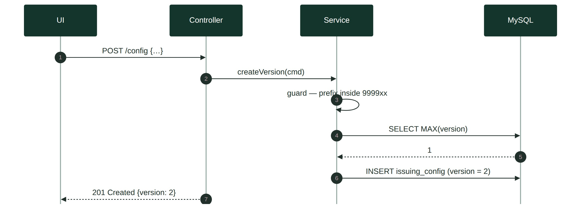
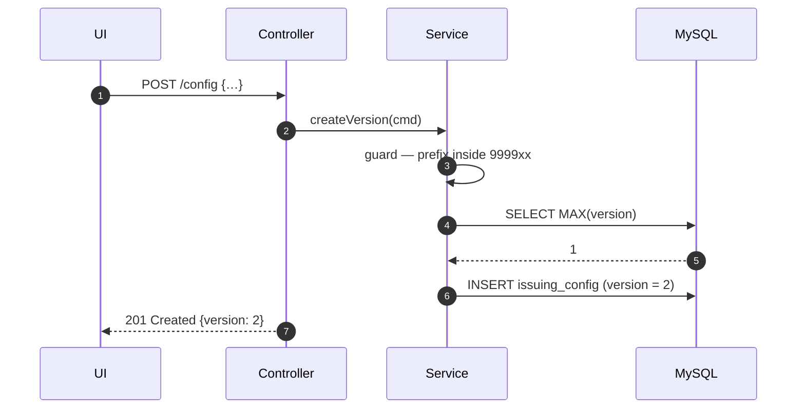
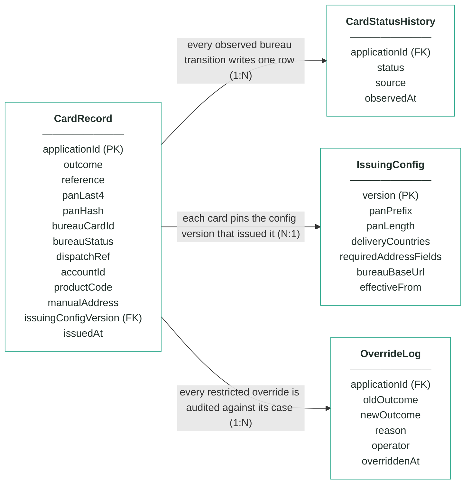
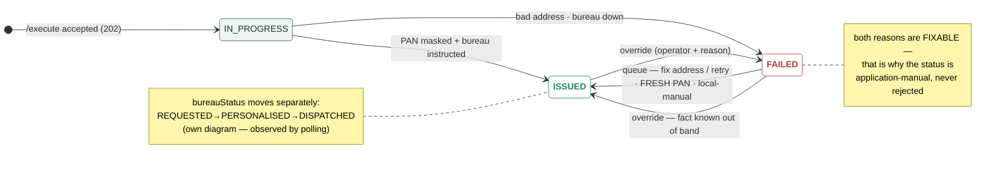
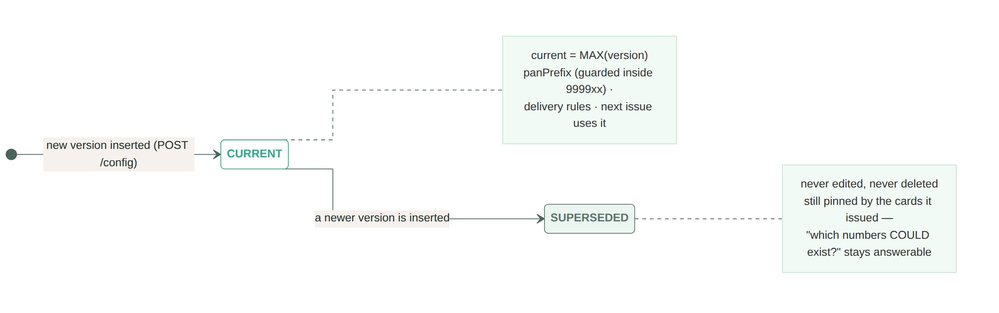
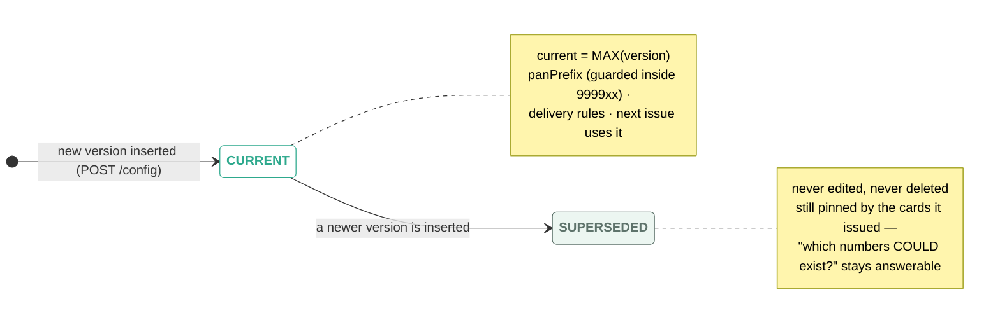

# Module 8 · Card Issuing — UC 08 · Edit Issuing Config

> AI implementation brief, generated from the v5 spec (`spec/.../use-cases/`). Source of truth is the spec; regenerate, don't hand-edit.

## Context

- Module: 8 · Card Issuing · category Integration · domain `card` · command `issue-card` · outcomes: ISSUED, FAILED
- Use case: 08 · Edit Issuing Config · track C · prerequisite: none (foundation) · build shape: DB-write→API→FE · primary screen: Issuing Configuration
- Data effect: insert-only
- Platform rules (non-negotiable): the orchestrator is the only caller; the whole application arrives in the envelope (plus the v5 `outputs` block, Option A); steps are independent and re-orderable; the payload is NEVER stored — only `applicationId`; every module ships `GET /cases/{id}/applicant` proxying the orchestrator; big lists are empty by default and capped at 10 rows (≤10 hydration calls); ALL APIs are idempotent — same request twice, same result once; every endpoint appears in the service's OpenAPI 3.0 (Swagger) spec.

## Story

As an issuing engineer I want to change the test PAN range and the delivery rules without a deploy — issuing policy ships as data.

## Contract

```
POST /config
{"panPrefix":"999901","panLength":16,
 "deliveryCountries":["GB","IE","FR"],
 "requiredAddressFields":
   ["line1","city","postcode","country"],
 "bureauBaseUrl":"http://mock-bureau:8091"}
→ 201 + {version: 2}
```

## Acceptance criteria

1. POST /config {panPrefix, panLength, deliveryCountries, requiredAddressFields, bureauBaseUrl} → 201; a NEW version row is inserted — never an update.
2. Seed data: IssuingConfig v1 exists on first boot — panPrefix 999900, panLength 16, deliveryCountries [GB, IE], all four address fields required.  ⟵ **checkpoint — exact value**
3. A panPrefix outside the reserved 9999xx test block → 400 with a message naming the rule — the config screen physically cannot point the generator at a real BIN range.
4. Invalid payload otherwise (empty countries, unknown address field, wrong length) → 400 with field-level errors.
5. The next issue (or queue retry) generates under the new current version; cards issued earlier still show the version that issued them — a range change never rewrites why an old card looks the way it does.
6. After the demo insert, v2 (prefix 999901, +FR) is current, and a fresh issue's last4 comes from the new range while Maria's card still pins v1.  ⟵ **checkpoint — exact value**

## Expected data changes

- **INSERT issuing_config** row with version = MAX + 1.
- **Never UPDATE, never DELETE** — history is the audit trail.
- Existing card_record rows untouched — their pinned issuingConfigVersion answers "which numbers could this system ever have generated, and where could they be posted?" per card, per date.

## Diagrams

> Rendered images first (for PDF/preview); the mermaid source is collapsed underneath for machine consumption.

### Sequence — this use case



<details><summary>mermaid source</summary>



</details>

### Entity model (suggested — the shape to beat)


**CardRecord — one card per applicationId (unique), masked from birth; no column can hold a full PAN**

| field | type | key | meaning |
|---|---|---|---|
| applicationId | string | PK | the journey key from the envelope — unique, the ONLY applicant-related column, AND the bureau instruction's reference |
| outcome | enum |  | ISSUED or FAILED — both FAILED reasons (bad address, bureau down) are fixable by a person, never a refusal |
| reference | string |  | human-facing case reference shown on screens and in the callback, e.g. crd-000064 — becomes outputs.cardId |
| panLast4 | char(4) |  | the last four digits, e.g. 4242 — the human-readable half of the masked pair; the column physically cannot hold more |
| panHash | char(64) |  | salted SHA-256 of the full PAN — answers "is this the same card?" for machines; NEVER the PAN itself |
| bureauCardId | string, nullable |  | the bureau's own id for the card, e.g. bur-77103; null on FAILED |
| bureauStatus | enum |  | the factory's lifecycle as last observed by polling: REQUESTED, PERSONALISED or DISPATCHED — moved by the bureau, never by command |
| dispatchRef | string, nullable |  | the postal tracking reference, e.g. RM-2214-9915 — null until the bureau reports DISPATCHED |
| accountId | string, nullable |  | module 7's account from outputs, e.g. acc-000123 — the account this card spends against; anchored-and-flagged if absent (re-ordered saga) |
| productCode | string |  | the product issued, e.g. CREDIT_CARD_REWARDS — drives card artwork/tier in the candidate design rule |
| manualAddress | boolean |  | true when an operator typed a corrected delivery address in the queue — the address itself is never persisted, only this trace |
| issuingConfigVersion | int | FK | the IssuingConfig version whose PAN range and delivery rules issued this card — pinned forever |
| issuedAt | timestamp, nullable |  | when the card was issued (PAN generated, bureau instructed); null on FAILED |

**IssuingConfig — insert-only, versioned PAN range and delivery rules; current = MAX(version)**

| field | type | key | meaning |
|---|---|---|---|
| version | int | PK | one new row per change — rows are inserted, never updated; current = MAX(version) |
| panPrefix | string |  | the reserved TEST range every PAN starts with (seeded 999900) — no real network owns it, so no generated number can collide with a live card |
| panLength | int |  | total PAN length including the Luhn check digit (seeded 16) |
| deliveryCountries | JSON |  | countries the bureau will post to (seeded [GB, IE]) — rule 2 rejects addresses outside them |
| requiredAddressFields | JSON |  | the fields an alternative delivery address must have (seeded [line1, city, postcode, country]) |
| bureauBaseUrl | string |  | where the mock bureau lives — the base URL for instructions and status polls |
| effectiveFrom | timestamp |  | when this version became the current one |

**CardStatusHistory — the observed bureau lifecycle; one append-only row per transition, written by the poller**

| field | type | key | meaning |
|---|---|---|---|
| applicationId | string | FK | the card whose observed transition this row records |
| status | enum |  | the bureau status observed: REQUESTED, PERSONALISED or DISPATCHED — the timeline screen reads straight off this |
| source | enum |  | how the observation happened: ISSUE (the initial instruction) or POLL (the scheduled status check) |
| observedAt | timestamp |  | when THIS module saw the transition — the bureau moves on its own clock; we find out by asking |

**OverrideLog — audit trail; one row per manual override, none ever deleted**

| field | type | key | meaning |
|---|---|---|---|
| applicationId | string | FK | the card case that was overridden |
| oldOutcome | enum |  | the outcome before the override |
| newOutcome | enum |  | the outcome after — a human-known fact asserted without touching the bureau |
| reason | string |  | the mandatory justification typed by the operator |
| operator | string |  | who performed the override |
| overriddenAt | timestamp |  | when it happened |

Relationships: CardRecord 1:N CardStatusHistory — every observed bureau transition writes one row · CardRecord N:1 IssuingConfig — each card pins the config version that issued it · CardRecord 1:N OverrideLog — every restricted override is audited against its case

<details><summary>mermaid source (generated from the spec tables)</summary>



</details>

### State transitions — the case record


<details><summary>mermaid source</summary>



</details>

### State transitions — the versioned configuration



<details><summary>mermaid source</summary>



</details>

## Out of scope

Deleting or editing an existing version (insert-only); the bureau's live dials (UC 05 — dials are state, config is policy); re-masking or re-ranging already-issued cards (history is history).

## Build notes

current = MAX(version) — no is_current flag. Validation: panPrefix numeric, 6 digits, inside the reserved 9999xx test block (the guard that keeps every future number un-real); panLength 16; deliveryCountries non-empty ISO codes; requiredAddressFields ⊆ {line1,line2,city,postcode,country} and non-empty. New issues and retries pick up the current version; every card pins issuingConfigVersion.

## Tests

Repository test: version increments; validation 400s (prefix outside 9999xx is THE test); flow test: next issue uses the new prefix, old cards keep their pin.

## Definition of done

All acceptance criteria verified against the running app · `./mvnw test` green · teammate-reviewed PR merged to main · fresh clone builds green · endpoint idempotent + present in the OpenAPI 3.0 (Swagger) spec · demoable from the UI.
